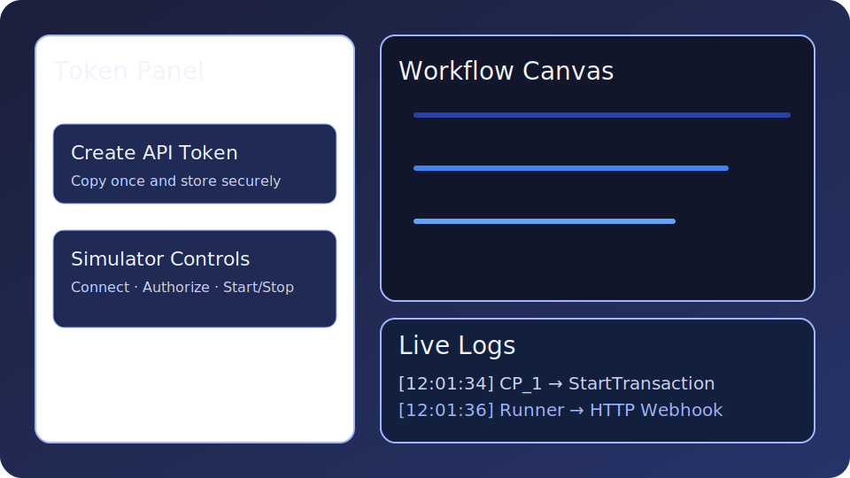

# Pipelet OCPP SDK

[](https://github.com/pipelet/Pipelet-OCPP-SDK/actions/workflows/ci.yml)
[](LICENSE)

A batteries-included developer stack for orchestrating **Pipelet** workflows reacting to OCPP events. The repository bundles a
Flask REST API, an OCPP 1.6 central system, a headless simulator and the Vite/React based workflow studio.

<div align="center">
  
</div>

## Quickstart

```bash
cp .env.example .env
docker compose up --build
```

- API: <http://localhost:9200>
- Frontend: <http://localhost:5173>
- OCPP Central System WebSocket: `ws://localhost:9000`

Once the containers are healthy, seed demo data to explore the pre-wired workflow:

```bash
make seed
```

The seed is idempotent and creates the latest built-in pipelets together with the **StartTransaction Flow** example workflow.

### Authentication

Every API request (except `/health`) requires a Bearer token. Create a token in the frontend **TokenPanel** or issue one via:

```bash
curl -X POST http://localhost:9200/api/auth/tokens \
  -H 'Content-Type: application/json' \
  -d '{"name": "local dev", "role": "admin"}'
```

The plaintext token is only shown once — copy it and use it as `Authorization: Bearer <token>` header and in the OCPP simulator
settings panel.

## Developer workflow

The repository ships with a convenience `Makefile`:

| Command           | Description                                    |
| ----------------- | ---------------------------------------------- |
| `make up`         | Build and launch the full Docker stack         |
| `make down`       | Stop and remove containers and volumes         |
| `make test`       | Execute the backend test-suite (pytest)        |
| `make seed`       | Synchronise built-in pipelets & demo workflow  |
| `make export`     | Export workflows & pipelets to `export.json`   |
| `make import`     | Import the contents of `export.json`           |

To develop frontend or backend code outside Docker, inspect [`docs/dev.md`](docs/dev.md) for virtualenv and Vite specific
instructions.

### Environment configuration

Configuration is controlled via `.env`. Duplicate the provided template to get started:

```bash
cp .env.example .env
```

| Variable | Purpose | Default |
| -------- | ------- | ------- |
| `DATABASE_URL` | SQLAlchemy/MySQL connection URL | `mysql+pymysql://app:app@db:3306/pipelet_sandbox` |
| `CORS_ALLOWED_ORIGINS` | Comma separated list of allowed origins | `http://localhost:5173` |
| `OCPP_WS_PORT` | TCP port for the central system WebSocket listener | `9000` |
| `API_RATE_LIMIT` | Rate limit (per minute) applied to authenticated requests | `100/minute` |

Set the `TOKEN` environment variable before running `make export` or `make import`.

## API collection

An end-to-end [Postman collection](docs/api.postman_collection.json) is available and covers health checks, token management,
pipelet & workflow CRUD, simulator controls, log retrieval as well as export/import. Import it into Postman or Insomnia to
exercise the stack with an existing token.

## Architecture overview

The high-level system architecture, runtime sequence diagrams and import/export formats are documented under
[`docs/architecture.md`](docs/architecture.md). The PlantUML sources in [`docs/diagrams`](docs/diagrams) can be rendered locally
(e.g. via <https://www.plantuml.com/plantuml/>) if you want to regenerate the PNG/SVG representations.

## Database utilities

Daily development routines are supported with utility scripts:

- [`backend/scripts/seed.py`](backend/scripts/seed.py) — Sync built-in pipelets and example workflow (idempotent).
- [`backend/scripts/backup.sh`](backend/scripts/backup.sh) — Create a timestamped MySQL dump in `backups/` (uses `.env`).
- [`backend/scripts/restore.sh`](backend/scripts/restore.sh) — Restore a dump produced by `backup.sh`.

Backups require a running database container. Pass `--env <file>` to target a different environment definition.

## Contributing

Guidelines for issues, pull requests and commit conventions are documented in [`CONTRIBUTING.md`](CONTRIBUTING.md).
Please review the project's [`Code of Conduct`](CODE_OF_CONDUCT.md) before participating in community spaces.
